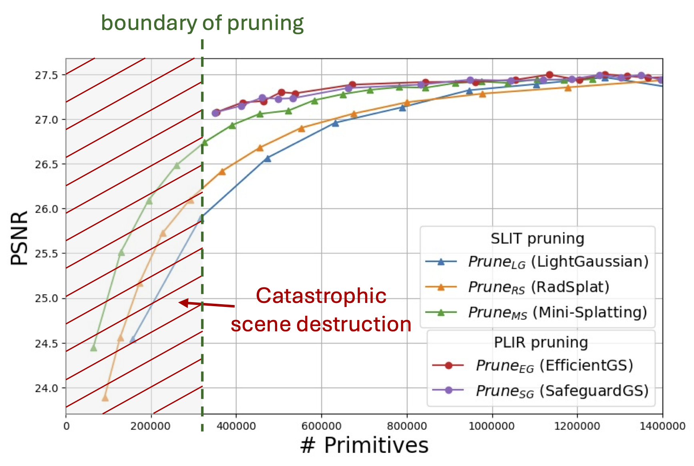

# SafeguardGS: 3D Gaussian Primitive Pruning While Avoiding Catastrophic Scene Destruction
Yongjae Lee, Zhaoliang Zhang, Deliang Fan<br>
| [arXiv](https://arxiv.org/abs/2405.17793) | [pdf](https://openaccess.thecvf.com/content/WACV2026/papers/Lee_SafeguardGS_3D_Gaussian_Primitive_Pruning_While_Avoiding_Catastrophic_Scene_Destruction_WACV_2026_paper.pdf) | [video](https://www.youtube.com/watch?v=K-2au5uFheA) |<br>


## Overview
In [the work](https://openaccess.thecvf.com/content/WACV2026/html/Lee_SafeguardGS_3D_Gaussian_Primitive_Pruning_While_Avoiding_Catastrophic_Scene_Destruction_WACV_2026_paper.html), the authors provide extensive experimental results comparing 3D Gaussian primitive pruning techniques combined with various score functions to identify the optimal setting for efficient [3DGS](https://dl.acm.org/doi/10.1145/3592433) training. This repository contains the implementation of the techniques and functions the authors described in the paper.

> Abstract: *3D Gaussian Splatting (3DGS) has advanced novel view synthesis, but its densification process leads to an excessive number of Gaussian primitives, which negatively impact rendering speed and memory usage. Although many 3DGS pruning techniques have been proposed to address this issue, a comprehensive analysis is still lacking. In this paper, we are the first to categorize 3DGS pruning techniques into two approaches: scene-level importance-threshold-based pruning and pixel-level importance-rank-based pruning, defined by their scope of importance calculation (scene-level vs. pixel-level) and their pruning criteria (threshold vs. rank). Our studies reveal that while the former leads to disastrous quality drops under extreme Gaussian primitive decimation, the latter not only sustains high rendering quality but also provides a natural pruning boundary, i.e., a safeguard for Gaussian pruning. We further propose multiple pruning score functions. From our extensive studies on various pruning score functions, we discover that color similarity with blending weight is the most effective factor for identifying insignificant primitives. In our experiments, our proposed method, SafeguardGS, with the optimal score function achieves the highest PSNR-per-primitive performance under extreme pruning setting, retaining only about 10% of the primitives from the original 3DGS scene, i.e., 10x compression ratio.*

## Quick start

Our work is based on [the 3DGS author's implementation](https://github.com/graphdeco-inria/gaussian-splatting). Here, we describe the basic installation and execution of our code, however, we highly recommend visiting [the 3DGS' code repository](https://github.com/graphdeco-inria/gaussian-splatting) for further details.

### Dataset
We tested our code on the common datasets for novel view synthesis (NVS) task. Download and locate them under `project_root/data/`. Like,
```
SafeguardGS/
├── data/
│   ├── db/               # Deep Blending
│   ├── mipnerf360/       # MipNeRF360
│   ├── nerf_synthetic/   # Nerf Synthetic
│   └── tandt/            # Tank&Temples
├── [other_directories...]

```
See the following links to download the datasets. Note that the T&T and DB are the versions provided by the 3DGS author.
- [Tanks&Temples and Deep Blending (T&T and DB)](https://repo-sam.inria.fr/fungraph/3d-gaussian-splatting/datasets/input/tandt_db.zip)
- [Nerf Synthetic](https://drive.google.com/file/d/18JxhpWD-4ZmuFKLzKlAw-w5PpzZxXOcG/view?usp=drive_link)
- [MipNeRF360](https://jonbarron.info/mipnerf360/)

### Installation & Run

1. Clone this repo and enter the project root directory.
```shell
git clone https://github.com/ASU-ESIC-FAN-Lab/SafeguardGS.git --recursive
cd SafeguardGS
```

2. Set up the conda environment.
```shell
conda env create -f environment.yml
conda activate SafeguardGS
```

3. Install submodules.
```shell
export CUDA_HOME=$CONDA_PREFIX
pip install submodules/diff-gaussian-rasterization submodules/simple-knn
```

4. Train and evaluate the model for the bicycle scene in mipnerf360. 
```shell
python train.py -s data/mipnerf360/bicycle -m output/mipnerf360/bicycle --eval # pruning method: 3DGS (default)
python train.py -s data/mipnerf360/bicycle -m output/mipnerf360/bicycle --prune_method compact_3dgs --eval # pruning method: compact_3dgs
python train.py -s data/mipnerf360/bicycle -m output/mipnerf360/bicycle --prune_method light_gaussian --eval # pruning method: light_gaussian
python train.py -s data/mipnerf360/bicycle -m output/mipnerf360/bicycle --prune_method random --eval # pruning method: random
python train.py -s data/mipnerf360/bicycle -m output/mipnerf360/bicycle --prune_method mini_splatting --eval # pruning method: mini_splatting
python train.py -s data/mipnerf360/bicycle -m output/mipnerf360/bicycle --prune_method rad_splat --eval # pruning method: rad_splat
python train.py -s data/mipnerf360/bicycle -m output/mipnerf360/bicycle --prune_method efficient_gs --eval # pruning method: efficient_gs
python train.py -s data/mipnerf360/bicycle -m output/mipnerf360/bicycle --prune_method safeguard_gs --eval # pruning method: safeguard_gs
```

### Pruning arguments
Each pruning method has specific arguments, see [arguments/\_\_init__.py](arguments/__init__.py). For the information about arguments provided by 3DGS, see [their description](https://github.com/graphdeco-inria/gaussian-splatting?tab=readme-ov-file#running).

<details>
<summary><span style="font-weight: bold;">Pruning arguments</span></summary>
  
  #### --prune_method compact_3dgs
  ```shell
  --compact_3dgs_mask_lr 0.01
  --compact_3dgs_lambda_mask 0.0005
  --compact_3dgs_prune_iter 1000
  ```
  #### --prune_method light_gaussian
  ```shell
  --light_gaussian_prune_iterations 20000
  --light_gaussian_prune_percent 0.6
  --light_gaussian_prune_decay 0.6
  --light_gaussian_v_pow 0.1
  ```
  #### --prune_method random
  ```shell
  --random_prune_iterations 15000
  --random_prune_ratio 0.1
  ```
  #### --prune_method mini_splatting
  ```shell
  --mini_splatting_prune_iterations 15000
  --mini_splatting_preserving_ratio 0.1
  --mini_splatting_imp_metric indoor
  ```
  #### --prune_method rad_splat
  ```shell
  --rad_splat_prune_threshold 0.01
  --rad_splat_prune_iterations 16000,24000
  ```
  #### --prune_method efficient_gs
  ```shell
  --efficient_gs_prune_iterations 15500
  --efficient_gs_prune_topk 1
  ```
  #### --prune_method safeguard_gs
  ```shell
  --safeguard_gs_purne_topk 10
  --safeguard_gs_prune_iterations 15000
  --safeguard_gs_score_function 0x01
  # Function IDs are defined using bitmasking. For example, `safeguard_gs_score_function=0x24`, which is SafeguardGS' choice, outputs `L1_color_error * alpha * transmittance`.
  # First 2 bytes:
  #   0x00. score = 1
  #   0x01. score = opacity
  #   0x02. score = alpha
  #   0x03. score = opacity * transmittance
  #   0x04. score = alpha * transmittance
  #   0x05. score = dist error
  #   0x06. score = dist error * opacity
  #   0x07. score = dist error * alpha
  #   0x08. score = dist error * opacity * transmittance
  #   0x09. score = dist error * alpha * transmittance
  # Last 2 bytes:
  #   0x10. score = color error (Cosine similarity)
  #   0x20. score = color error (Manhattan distance)
  #   0x30. score = exp color error (Manhattan distance)
  --safeguard_gs_p_dist_activation_coef 1.0
  --safeguard_gs_c_dist_activation_coef 1.0
  ```
</details>
<br>

## Differentiable rasterizer

The 3DGS authors implemented a differentiable rasterizer as a CUDA extension. We added score function implementations on top of it for efficiency purposes. For software and hardware requirements, see their description [here](https://github.com/graphdeco-inria/gaussian-splatting?tab=readme-ov-file#hardware-requirements).


## Acknowledgments
The authors thank the authors for sharing their ideas. We referred to [3DGS](https://arxiv.org/abs/2308.04079), [Compact 3DGS](https://arxiv.org/abs/2311.13681), [LightGaussian](https://arxiv.org/abs/2311.17245), [Mini-Splatting](https://arxiv.org/abs/2403.14166), [RadSplat](https://arxiv.org/abs/2403.13806), and [EfficientGS](https://arxiv.org/abs/2404.12777) to build our platform.

<section class="section" id="BibTeX">
  <div class="container is-max-desktop content">
    <h2 class="title">BibTeX</h2>
    If you find this repository helpful, please cite this paper. </br>
    <pre><code>@InProceedings{Lee_2026_WACV,
      author    = {Lee, Yongjae and Zhang, Zhaoliang and Fan, Deliang},
      title     = {SafeguardGS: 3D Gaussian Primitive Pruning While Avoiding Catastrophic Scene Destruction},
      booktitle = {Proceedings of the IEEE/CVF Winter Conference on Applications of Computer Vision (WACV)},
      month     = {March},
      year      = {2026},
      pages     = {8479-8489}
}</code></pre>
  </div>
</section>
